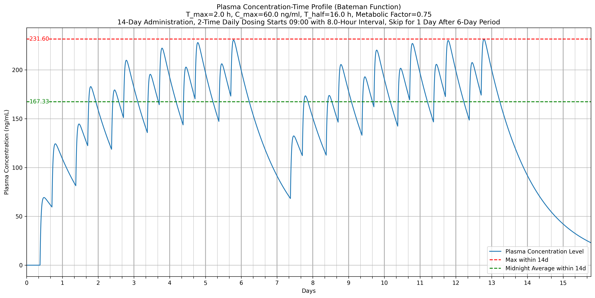

# Interactive Plasma Concentration Visualization

[中文版本](README_CHINESE.md)

## Overview

This interactive tool visualizes plasma concentration profiles of medications over time using pharmacokinetic principles. It helps understand how different dosing regimens and drug formulations affect medication concentration in the bloodstream, which is crucial for optimizing therapeutic outcomes while minimizing adverse effects.

## Features

* **Interactive Visualization**: Adjust parameters like $T_{max}$, $C_{max}$, $T_{1/2}$, and dosing schedules in real-time
* **Bateman Function Implementation**: Mathematical modeling of drug absorption and elimination
* **Multiple Dosing Regimens**: Simulate various dosing frequencies and patterns
* **Advanced Metrics**: Calculate medication exposure i.e. Area Under the Curve (AUC), average concentrations, and more
* **Metabolic Adjustment**: Account for individual variations in drug metabolism
* **Flexible Dosing Patterns**: Model skip-day dosing, variable intervals, and custom timing

## Usage

* **Google Colab**: Most convenient, click the "Open in Colab" badge above, or [Run in Google Colab](https://colab.research.google.com/github/LongshengDu/plasma-concentration-vis/blob/master/main.ipynb)
* **Jupyter.org**: These are [Static Webpages](https://jupyter.org/try) can run locally and use browser's local storage, use `File -> Open from URL...` for [main.ipynb](https://raw.githubusercontent.com/LongshengDu/plasma-concentration-vis/refs/heads/master/main.ipynb) or upload local file
* **JupyterLab Desktop**: Download and install [JupyterLab Desktop App](https://github.com/jupyterlab/jupyterlab-desktop/releases), download [main.ipynb](https://raw.githubusercontent.com/LongshengDu/plasma-concentration-vis/refs/heads/master/main.ipynb) and open locally 
* **VScode**: Install [VSCode Jupyter](https://marketplace.visualstudio.com/items/?itemName=ms-toolsai.jupyter) extension pack and local Python environment

## Pharmacokinetic Principles

The tool implements the Bateman function to model drug absorption and elimination:

$$C(t) = A \cdot (e^{-K_e \cdot t} - e^{-K_a \cdot t})$$

Where:
* $C(t)$ = Plasma concentration at time $t$
* $A$ = Coefficient based on dose and distribution volume
* $K_e$ = Elimination rate constant (related to $T_{1/2}$)
* $K_a$ = Absorption rate constant
* $t$ = Time since dose administration

## Interactive Parameters

The tool includes adjustable parameters:

| Parameter          | Description                                |
|:------------------:|:------------------------------------------:|
| Save Plot          | Option to save visualization               |
| Y-axis Limit       | Set upper limit for concentration          |
| $T_{max}$          | Time to maximum concentration              |
| $C_{max}$          | Maximum concentration                      |
| $T_{1/2}$          | Elimination half-life                      |
| Metabolic Factor   | Individual metabolism adjustment           |
| Total Days         | Duration of simulation                     |
| Doses per Day      | Frequency of administration                |
| Initial Dose Time  | First dose timing each day                 |
| Dose Interval      | Time between doses                         |
| Skip Dose Period   | Skip after consecutive dosage days         |

## Reference Samples

| Type  |  Dose $(mg)$  | $\mathbf{C_{max}} (ng/ml)$ |  $\mathbf{T_{max}} (h)$  | $\mathbf{T_{1/2}} (h)$ |          Dosing          |
|:-----:|:-------------:|:--------------------------:|:------------------------:|:----------------------:|:------------------------:|
| IR    |     75        |      80                    |    1.5                   |     5                  |        2/d, q.8h         |
| SR    |     100       |      85                    |     3                    |     10                 |           1/d            |
| XL    |     150       |     120                    |     5                    |     21                 | 1/d, skip every 3rd day  |

## Sample Plot

Medication specification: $C_{max} = 60ng/ml, T_{max}=2h, T_{1/2}=16h$

Modeling parameters: 0.75 metabolic factor (slower metabolism), 14 total simulated days, taken twice daily, first dose each of day is at 9 AM, with an 8-hour interval between doses. After 6 consecutive days of medication, skip one day

## License

This project is licensed under the [MIT License](LICENSE)
