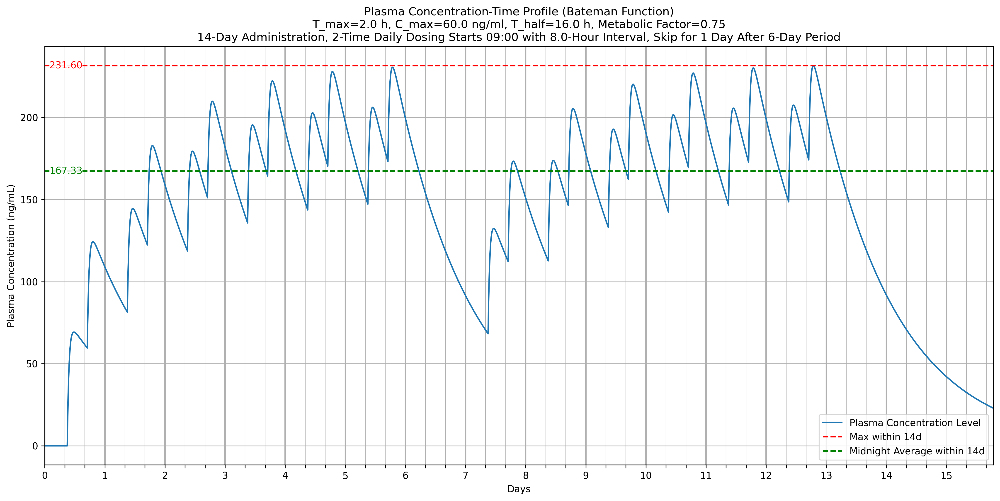

# 交互式药物血浆浓度可视化工具

[English Version](README.md)

## 概述

本工具通过药代动力学原理，交互式地可视化药物随时间变化的血浆浓度曲线。它有助于理解不同给药方案和药物制剂如何影响血液中的药物浓度，从而优化治疗效果并减少不良反应。

## 功能

* **交互式可视化**：实时调整参数，如 $T_{max}$, $C_{max}$, $T_{1/2}$ 和给药计划
* **Bateman 函数实现**：建模药物的吸收和消除过程
* **多种给药方案**：模拟不同的给药频率和模式
* **高级指标**：计算药物暴露量（曲线下面积 AUC）、平均浓度等
* **代谢调整**：考虑个体差异对药物代谢的影响
* **灵活的给药模式**：支持跳日给药、可变给药间隔和自定义给药时间

## 使用方法

* **Google Colab**：最便捷的方式，点击上方的 “Open In Colab” 徽章，或 [使用Google Colab打开](https://colab.research.google.com/github/LongshengDu/plasma-concentration-vis/blob/master/main.ipynb)
* **Jupyter.org**：通过 [静态网页](https://jupyter.org/try) 运行，使用浏览器的本地存储。通过 `File -> Open from URL...` 打开 [main.ipynb](https://raw.githubusercontent.com/LongshengDu/plasma-concentration-vis/refs/heads/master/main.ipynb) 或上传本地文件
* **JupyterLab Desktop**：下载并安装 [JupyterLab 桌面应用](https://github.com/jupyterlab/jupyterlab-desktop/releases)，下载 [main.ipynb](https://raw.githubusercontent.com/LongshengDu/plasma-concentration-vis/refs/heads/master/main.ipynb) 并在本地打开
* **VScode**：安装 [VSCode Jupyter](https://marketplace.visualstudio.com/items/?itemName=ms-toolsai.jupyter) 插件和本地 Python 环境

## 药代动力学原理

该工具基于 Bateman 函数建模药物的吸收和消除过程：

$$C(t) = A \cdot (e^{-K_e \cdot t} - e^{-K_a \cdot t})$$

其中：
* $C(t)$ = 时间 $t$ 时的血浆浓度
* $A$ = 基于剂量和分布体积的系数
* $K_e$ = 消除速率常数（与 $T_{1/2}$ 相关）
* $K_a$ = 吸收速率常数
* $t$ = 给药后的时间

**具体模型构建： [Markdown](pharmacokinetic.md) / [PDF](pharmacokinetic.pdf)**

## 交互参数

该工具提供以下可调参数：

|     参数     |          描述          |
|:------------:|:---------------------:|
|  保存图像     |   保存可视化图像的选项    |
|  Y轴限制      |   设置绘图浓度上限      |
|  $T_{max}$   |   药物血浆浓度达峰时间   |
|  $C_{max}$   |   药物血浆最大浓度      |
|  $T_{1/2}$   |   终末消除半衰期        |
|  代谢因子     |   个体代谢调整          |
|  总天数       |   总模拟时间           |
|  每日剂量次数  |   每日给药频率         |
|  初始给药时间  |   每日初次给药的时间    |
|  给药间隔     |   每次给药之间的时间     |
|  剂量跳过周期  |  连续给药几天后跳过一次  |

## 参考实例

| 类型  | 剂量 $(mg)$ | $\mathbf{C_{max}} (ng/ml)$ |  $\mathbf{T_{max}} (h)$  | $\mathbf{T_{1/2}} (h)$ |         给药方案         |
|:----:|:-----------:|:-------------------------:|:-------------------------:|:----------------------:|:-----------------------:|
|  IR  |    75       |            80             |          1.5              |        5               |   每日两次，每8小时一次   |
|  SR  |    100      |            85             |          3                |        10              |          每日一次        |
|  XL  |    150      |            120            |          5                |        21              | 每日一次，每三天跳过一天   |

## 示例图表

药物规格：血浆最大浓度60ng/ml，血浆浓度达峰时间2小时，终末消除半衰期16小时

模型参数：代谢因子0.75（慢代谢），模拟14天用药，每日两次，每天初次给药时间早上9点，给药间隔8小时，连续用药6天后跳过一天

## 许可证

本项目基于 [MIT 许可证](LICENSE) 授权
